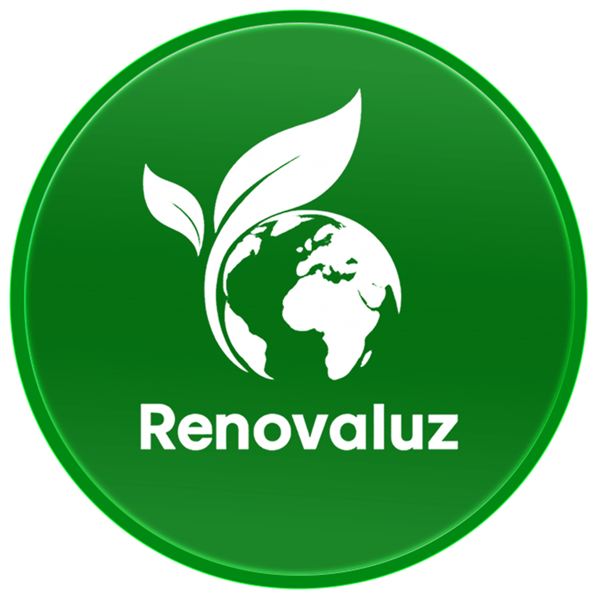

# 🌿 RenovaLuz Hub Oficinal

  

  <strong>Inovação, Renovação e Sustentabilidade Ambiental em Angola.</strong>

---

## ✨ Sobre a RenovaLuz
A **RenovaLuz** é uma empresa angolana comprometida com o desenvolvimento de soluções ecológicas adaptadas à realidade local. Transformamos desafios ambientais em soluções inteligentes através da tecnologia e inovação constante.

### 🎙️ Conheça a Luísa
A **Luísa** é a nossa mascote e avatar oficial. Ela personifica a nossa voz, representando a ponte entre a tecnologia da **Renovatech** e a consciência ambiental da **RenovaLuz**.

---

## 🔗 Links Rápidos e Conexões

| Canal | Link de Acesso |
| :--- | :--- |
| 🌐 **Site Oficial** | [renovaluz.ao](https://renovaluz.ao/index.html) |
| 📸 **Instagram** | [@renovaluzoficial](https://www.instagram.com/renovaluzoficial/) |
| 💼 **LinkedIn** | [RenovaLuz Oficial](https://www.linkedin.com/in/renovaluz-oficial-57956a377/) |
| 🔵 **Facebook** | [Acesse aqui](https://bit.ly/4wgQ8FB) |
| 🟢 **WhatsApp (RenovaLuz)** | [+244 948 504 916](https://wa.me/244948504916) |
| ⚡ **WhatsApp (Renovatech)** | [+244 926 955 286](https://wa.me/244926955286) |

---

## 🚀 Nossa Missão em Números
*   🌍 **Impacto Nacional:** Projetos em todas as províncias de Angola.
*   💡 **Inovação:** Tecnologia avançada para gestão de resíduos e energia.
*   🤝 **Comunidade:** Parcerias locais para um futuro verde e sustentável.

---

## 🛠️ Tecnologia do Projeto
Esta Bio-Page foi desenvolvida com:
*   **HTML5 / CSS3** (Efeito Glassmorphism & UI Premium)
*   **JavaScript** (Interruptor de modo de luz e interações)
*   **Video Background** (Imersão visual completa)

---

  
   
  Escaneie para visitar nosso site oficial

  © 2026 <b>RenovaLuz by Renovatech</b>. Todos os direitos reservados.

